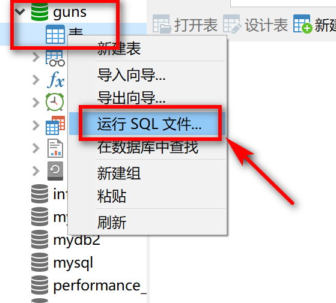
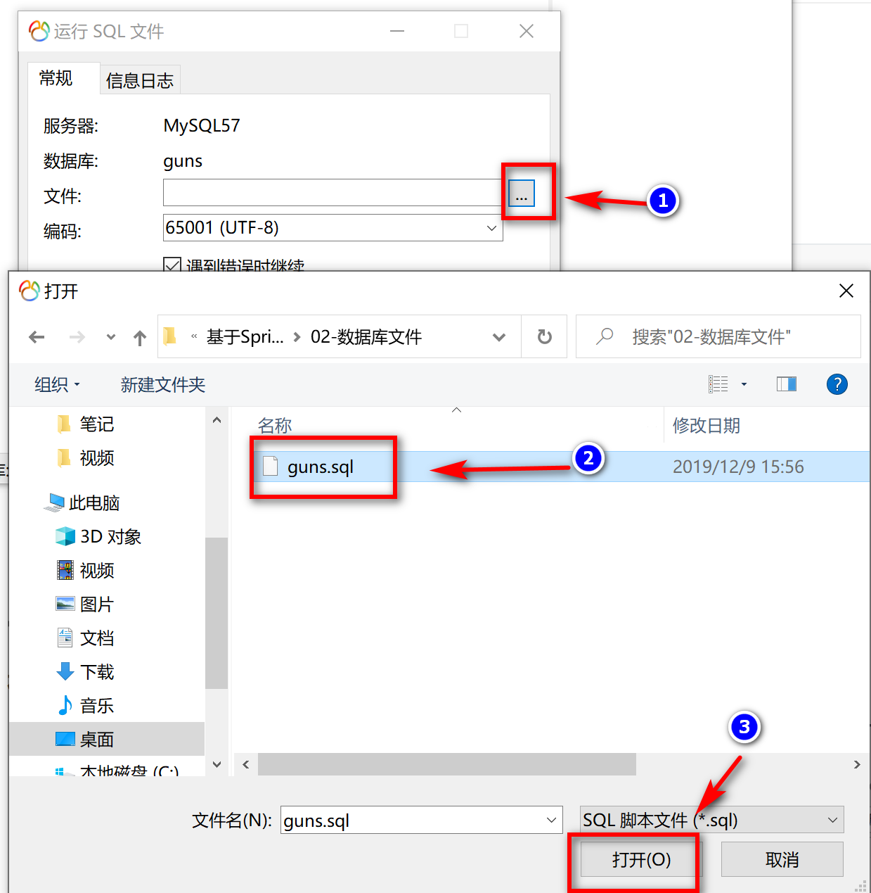
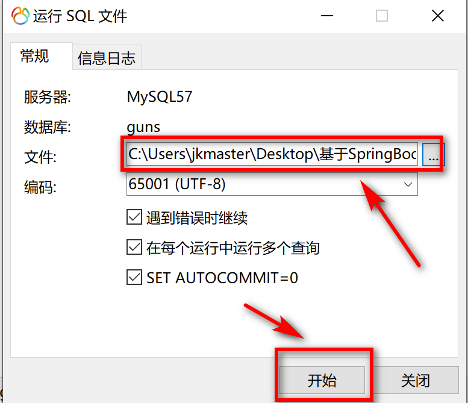
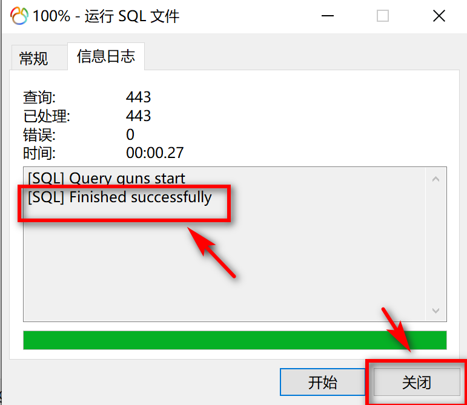
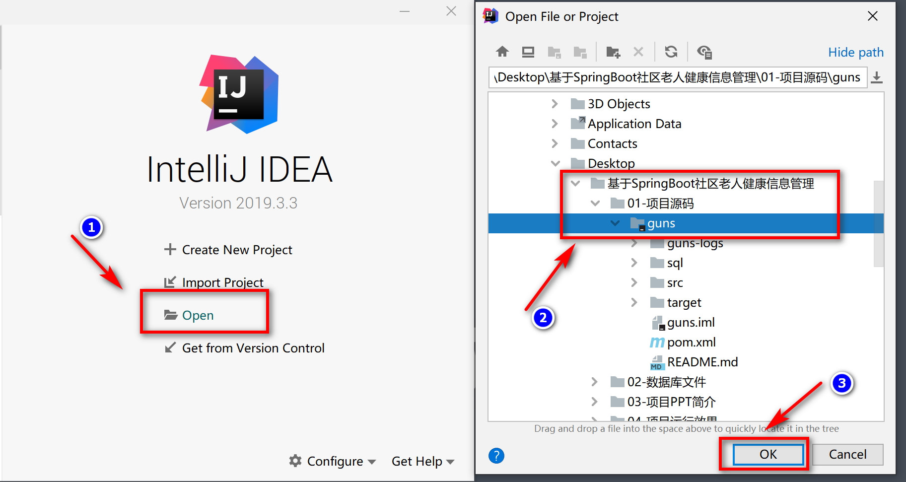
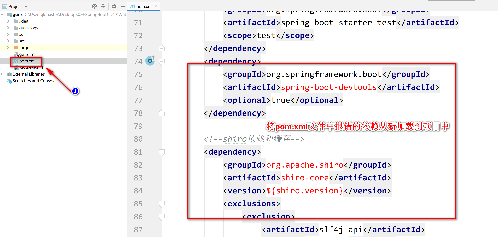
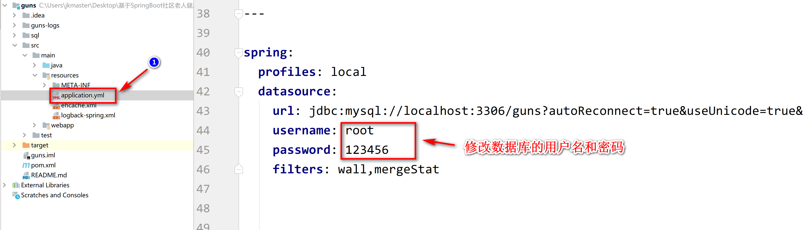

# 房租租赁系统安装文档


### 一、操作数据库

#### 1、创建数据库

```mysql
CREATE DATABASE guns;
```

#### 2、在资料中找到数据库文件执行sql文件









### 二、启动项目

**在资料中找到项目完整源码，在IDEA中打开项目**





**修改数据库配置**




## 三、启动项目


管理员

​	账号：admin

​	密码：admin

老人

​	账号：hy

​	密码：111111

医生

​	账号：doctor

​	密码：111111


​	

